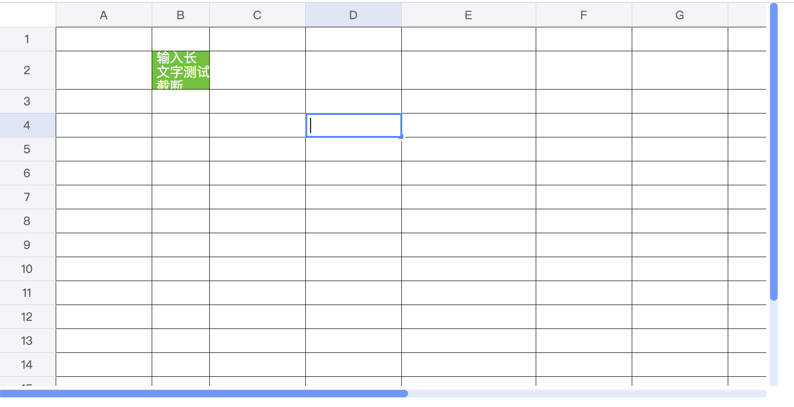
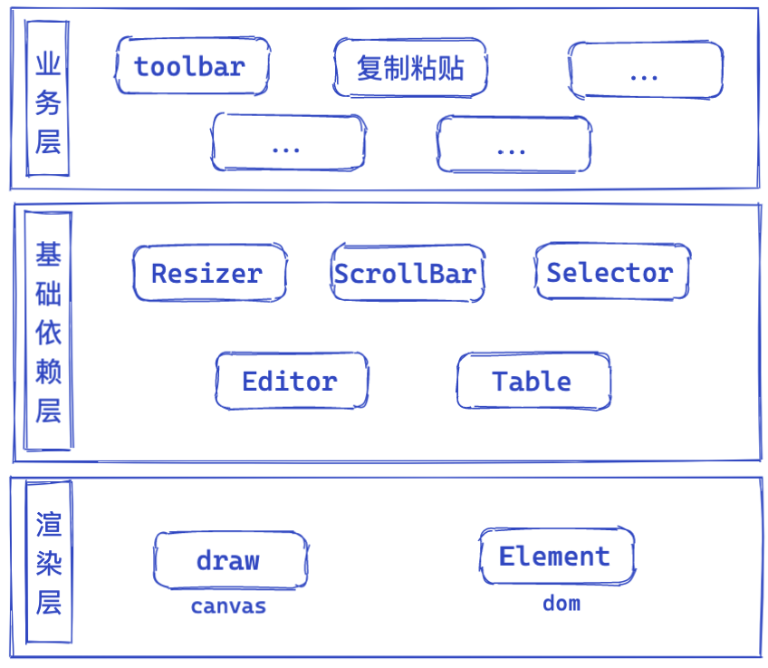

# web excel

[在线预览](https://emilyyoung71415.github.io/web-excel/index.html)



使用
===

直接在浏览器里引用

```html
<link href="//github.com/EmilyYoung71415/web-excel/blob/gh-pages/styles/webexcel.css" rel="stylesheet"></head>
<body onload="load()">
    <div id="app">
        <div id="webexcel"></div>
    </div>
    <script>
        function load() {
            webexcel(document.getElementById('webexcel'))
                .loadData({
                    borders: [
                        [1, 'dashed', '#0366d6'],
                    ],
                    styles: [
                        { bgcolor: 'rgb(82, 196, 26)', bi: 0, color: '#FFF' },
                    ],
                    rowm: {// 特殊列 列高
                        1: { height: 40}
                    },
                    colm: {
                        1: { width: 60 },
                        4: { width: 140 }
                    },
                    cellmm: {
                        1: {
                            1: { text: '输入长文字测试截断', si: 0 },
                        },
                    },
                })
        }
    </script>
    <script type="text/javascript" src="//github.com/EmilyYoung71415/web-excel/blob/gh-pages/webexcel.js"></script>
</body>
```

option配置

```js
// default options
{
    rowm: {// 特殊列 列高
        1: { height: 40}
    },
    colm: {
        1: { width: 60 },
        4: { width: 140 }
    },
    cellmm: {// 单元格数据
        1: {
            1: { text: '输入长文字测试截断', si: 0 },
        },
    },
    borders: [
        [1, 'dashed', '#0366d6'],
    ],
    styles: [
        { bgcolor: 'rgb(82, 196, 26)', bi: 0, color: '#FFF' },
    ],
    viewRect: { // 整个表格容器大小 = canvas大小
        height: 400,
        width: 800,
    },
    row: { // 表格初始化 10行 每行25px高
        len: 20,
        height: 25,
    },
    col: {
        len: 15,
        width: 100,
        indexWidth: 60, // 列索引栏宽度
        minWidth: 60, // 伸缩最小宽度
    },
    style: {
        bgcolor: '#ffffff',
        align: 'left',
        valign: 'top',
        wrapText: true, // 文字分行
        textDecoration: 'normal',
        color: '#333333',
        contentLineSize: 0.5,
        contentLineColor: '#d0d0d0',
        fixedheaderstyle: {
            bgcolor: '#f4f5f8',
            textAlign: 'center',
            textBaseline: 'middle',
            font: {
                size: 12,
                family: 'sans-serif',
            },
            fillStyle: '#585757',
            lineWidth: 0.5,
            strokeStyle: '#d0d0d0',
        },
        font: {
            family: 'Arial',
            size: 14,
            bold: false,
            italic: false,
        },
    },
}
```

运行
===

```bash
npm i
npm start
```

实现功能
===

版本0.1：表格基本渲染能力
- [x] 坐标网格渲染
- [x] 行列伸缩
- [x] 滚动
- [x] 单元格文字渲染处理(换行、溢出)
- [x] 选中框
- [x] 编辑框 

敬请期待：
- [ ] 合并单元格
- [ ] 复制粘贴
- [ ] 插件机制
....

原理概览
===

