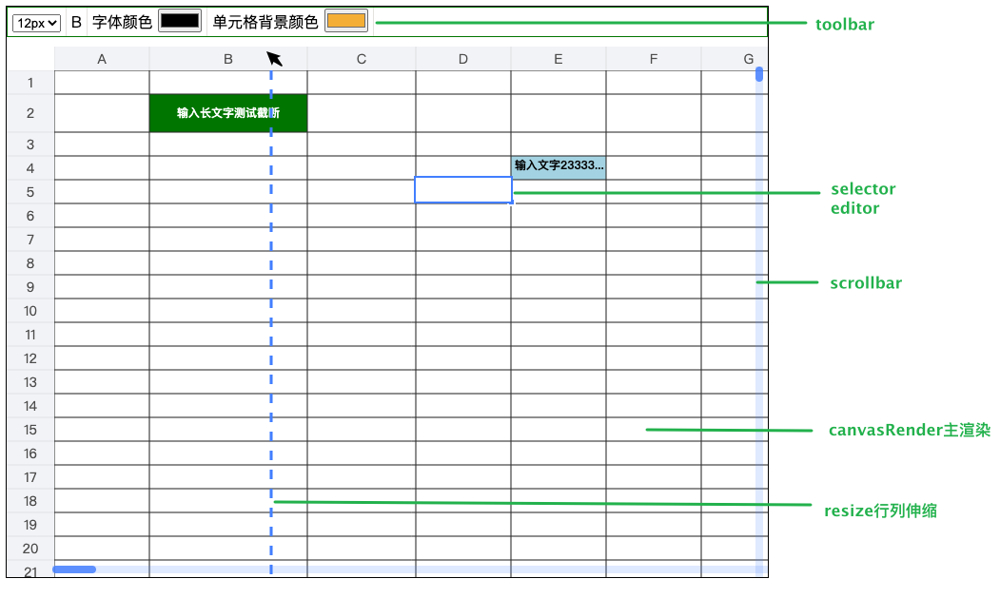
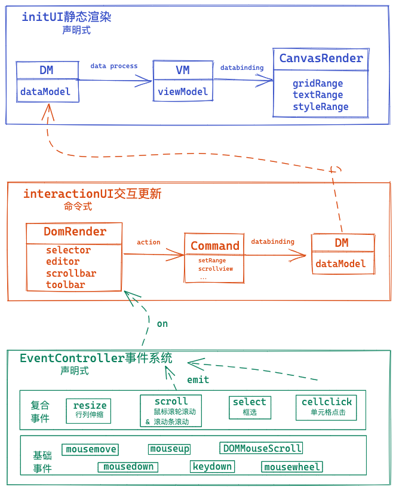

# web excel

[在线预览](https://emilyyoung71415.github.io/web-excel/index.html)



运行
===

```bash
npm i
npm start
```

说明
===

功能：

- [x] 坐标网格渲染
- [x] 行列伸缩
- [x] 滚动
- [x] 单元格文字渲染处理(换行、溢出省略、居中)
- [x] 选中框
- [x] 编辑框 
- [x] 单元格属性更改: 字体大小、字体加粗、字体颜色、单元格背景色
- [ ] 合并单元格
- [ ] 复制粘贴
- [ ] 撤销前进

⭐️ feature
- 全面拥抱TS
- 计算缓存
- 单元格更新支持局部渲染
- 更细致的分层：event(aciton) -> command -> datamodel -> viewdata -> render
- 渲染机制更新：canvas声明式更新、dom命令式更新
- 模块松耦
- 事件系统
- 开放view注册：registerview

使用
===

直接在浏览器里引用

```html
<link href="/styles/webexcel.css" rel="stylesheet"></head>
<body onload="load()">
    <div id="app">
        <div id="webexcel"></div>
    </div>
    <script>
        function load() {
            const myexcel = XWebExcel.create(
                document.getElementById('app'), 
                {
                    viewOption: {
                        showToolbar: true,
                        viewHeight: 600,
                        viewWidth: 800,
                    },
                    interactOption: {
                        canEdit: true 
                    }
                }
            );
            // 棋盘数据
            myexcel.griddata({
                row: {
                    size: 25,   // 行高
                    len: 1200,    // 行总数
                },
                col: {
                    size: 100,  // 列宽
                    len: 140,
                },
                rowm: {// 特殊列 列高
                    1: { size: 40}
                },
                // colm: {
                //     1: { size: 60 },
                //     4: { size: 140 }
                // },
            });
            // 表格数据
            myexcel.source({
                cellmm: {
                    1: {
                        1: {
                            text: '输入长文字测试截断',
                            bgcolor: 'green',
                            fontColor: '#fff',
                            fontWeight: 'bold'
                        },
                    },
                    3: {
                        4: {
                            bgcolor: 'lightblue',
                            text: '输入文字2333333erewrwedewrew',
                            fontWeight: 'bold'
                        },
                    },
                },
            });
        }
    </script>
    <script type="text/javascript" src="/excel.js"></script>
</body>
```

原理概览
===

